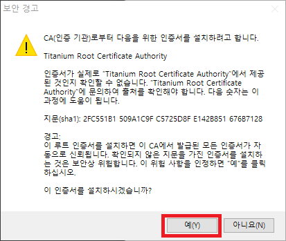
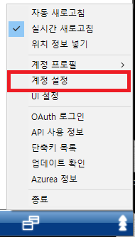
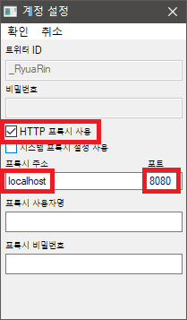
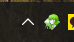



아즈레아 산소호흡기
===

1. [여기](https://github.com/RyuaNerin/AzureaProxy/releases/latest) 에서 프로그램을 다운로드합니다.

2. **1** 에서 다운로드한 프로그램을 실행 후 트위터 로그인을 진행합니다.

3. 이런 창이 뜨면 **예(Y)** 눌러줍니다.

4. 아즈레아에서 다음과 같이 설정합니다.

5. 종료하려면 트레이 아이콘을 두 번 클릭합니다

